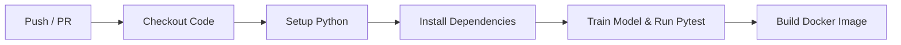

# Customer Churn Prediction MLOps Application

A beginner-friendly Machine Learning Operations (MLOps) project demonstrating the end-to-end lifecycle of a production-ready machine learning service:

$$\text{Data} \longrightarrow \text{Model Training} \longrightarrow \text{Code \& API} \longrightarrow \text{Deployment} \longrightarrow \text{Monitoring}$$

---

## 1. What is the Application?

This project is a complete **Customer Churn Prediction Service**. Customer churn occurs when a subscriber or customer stops doing business with a company. 

Using historical customer usage, billing, and support interaction metrics, our machine learning model predicts whether a customer is likely to churn (`1`) or stay (`0`), helping businesses proactively retain high-risk customers.

---

## 2. What is MLOps?

**MLOps (Machine Learning Operations)** is a set of engineering practices that automates and standardizes the entire lifecycle of machine learning systems. While standard software engineering focuses on code, MLOps unifies:

- **Data Management & Preprocessing:** Reproducible data cleaning and transformation pipelines.
- **Model Training & Experiment Tracking:** Tracking hyperparameters, metrics, and model versions (using MLflow).
- **Deployment & Serving:** Exposing models via modern REST APIs (using FastAPI) packaged in containers (using Docker).
- **Continuous Integration (CI):** Automated testing and building on code commits (using GitHub Actions).
- **Monitoring:** Tracking real-time inputs, prediction outcomes, and service latency in production.

---

## 3. Project Architecture & File Structure

```
customer-churn-mlops/
│
├── data/
│   └── customers.csv            # Synthetic sample dataset with customer metrics
│
├── src/
│   ├── data_preprocessing.py    # Data loading, cleaning, encoding, and splitting
│   ├── train.py                 # Logistic Regression training with MLflow tracking
│   └── predict.py               # Inference helper to load model and run predictions
│
├── models/
│   └── model.joblib             # Saved scikit-learn pipeline artifact
│
├── api/
│   └── main.py                  # FastAPI REST service with logging & monitoring
│
├── tests/
│   └── test_api.py              # Pytest automated test suite for endpoints & inputs
│
├── logs/
│   └── prediction_monitoring.log# Runtime prediction logs for latency and input drift
│
├── requirements.txt             # Python project dependencies
├── Dockerfile                   # Container packaging recipe
├── .gitignore                   # Files and folders excluded from Git
├── README.md                    # Project documentation
└── .github/
    └── workflows/
        └── ci.yml               # GitHub Actions CI workflow (test + docker build)
```

---

## 4. How to Install Dependencies

### Prerequisites
- Python 3.9+ (or 3.10+)
- `pip`

### Step-by-Step Setup

1. **Create and activate a virtual environment:**
   ```bash
   # On macOS/Linux
   python3 -m venv venv
   source venv/bin/activate

   # On Windows (PowerShell)
   python -m venv venv
   .\venv\Scripts\Activate.ps1
   ```

2. **Install required packages:**
   ```bash
   pip install --upgrade pip
   pip install -r requirements.txt
   ```

---

## 5. How to Train the Model

To train the Logistic Regression pipeline and record the experiment:

```bash
python src/train.py
```

### What happens during training?
1. Loads data from `data/customers.csv`.
2. Encodes categorical variables (`contract_type`) and standardizes numerical variables (`age`, `monthly_bill`, `tenure_months`, `support_calls`, `usage_hours`).
3. Trains a Logistic Regression model.
4. Calculates metrics: **Accuracy, Precision, Recall, F1 Score**.
5. Logs experiment parameters, metrics, and model artifacts to **MLflow**.
6. Exports the finalized model pipeline to `models/model.joblib`.

---

## 6. How to View MLflow Tracking UI

MLflow logs all runs, metrics, and model artifacts locally in the `mlruns/` directory.

Start the MLflow UI:

```bash
mlflow ui
```

Open your browser and navigate to:
```
http://localhost:5000
```
Here you can explore the `customer-churn` experiment, compare runs, view metrics (accuracy, precision, recall, f1), and inspect logged model artifacts.

---

## 7. How to Start the FastAPI Server

Launch the prediction server with Uvicorn:

```bash
uvicorn api.main:app --host 0.0.0.0 --port 8000 --reload
```

Once running, interactive documentation is available at:
- **Swagger UI:** [http://localhost:8000/docs](http://localhost:8000/docs)
- **ReDoc:** [http://localhost:8000/redoc](http://localhost:8000/redoc)

---

## 8. How to Test the API

### Automated Testing with Pytest
Run the test suite:

```bash
pytest tests/ -v
```

### Manual Testing with cURL

#### 1. Check Health Status (`GET /health`)
```bash
curl -X GET http://localhost:8000/health
```
**Response:**
```json
{
  "status": "healthy"
}
```

#### 2. Predict Churn (`POST /predict`)
```bash
curl -X POST http://localhost:8000/predict \
  -H "Content-Type: application/json" \
  -d '{
    "age": 35,
    "monthly_bill": 75.5,
    "tenure_months": 12,
    "support_calls": 3,
    "usage_hours": 25.0,
    "contract_type": "monthly"
  }'
```
**Response:**
```json
{
  "churn_prediction": 1,
  "message": "Customer is likely to churn"
}
```

---

## 9. How to Build and Run with Docker

Containerization ensures your application runs consistently across any environment.

### 1. Build the Docker Image
```bash
docker build -t customer-churn-mlops .
```

### 2. Run the Docker Container
```bash
docker run -d -p 8000:8000 --name churn-app customer-churn-mlops
```

### 3. Verify Container is Running
```bash
curl http://localhost:8000/health
```

### 4. Stop the Container
```bash
docker stop churn-app
docker rm churn-app
```

---

## 10. How GitHub Actions Demonstrates CI

The GitHub Actions workflow in `.github/workflows/ci.yml` automates quality checks on every push or pull request to `main`:



1. **Checkout Code:** Retrieves the latest repository state.
2. **Setup Python:** Sets up a clean Python 3.10 environment.
3. **Install Dependencies:** Installs packages from `requirements.txt`.
4. **Test Execution:** Executes `src/train.py` and `pytest tests/ -v` to ensure model training and API contract compliance.
5. **Docker Build:** Verifies that the container image builds without errors.

---

## 11. Monitoring in Action

Every time `/predict` is called, a structured log entry is appended to `logs/prediction_monitoring.log` and output to the terminal:

```json
{
  "timestamp": "2026-09-11T12:00:00.123456Z",
  "input_features": {
    "age": 35,
    "monthly_bill": 75.5,
    "tenure_months": 12,
    "support_calls": 3,
    "usage_hours": 25.0,
    "contract_type": "monthly"
  },
  "prediction": 1,
  "message": "Customer is likely to churn",
  "response_time_ms": 4.12
}
```

This simple monitoring enables tracking of:
- **API Latency** (performance regressions)
- **Input Data Distribution** (data drift detection)
- **Prediction Frequency** (concept drift tracking)
